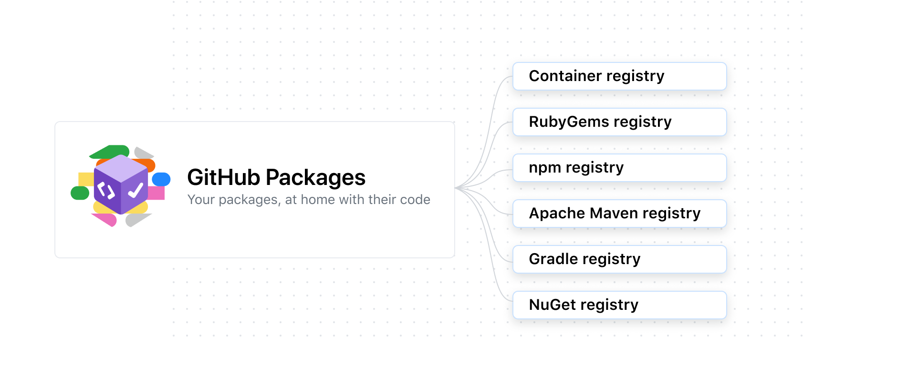

## NPM & GitHub Packages

GitHub Packages is a software package hosting service that allows you to host your software packages privately or publicly and use packages as dependencies in your projects.

GitHub Packages is available with GitHub Free, GitHub Pro, GitHub Free for organizations, GitHub Team, GitHub Enterprise Cloud, GitHub Enterprise Server 3.0 or higher, and GitHub AE. GitHub Packages is not available for private repositories owned by accounts using legacy per-repository plans

#### About GitHub Packages

GitHub Packages is a platform for hosting and managing packages, including containers and other dependencies. GitHub Packages combines your source code and packages in one place to provide integrated permissions management and billing, so you can centralize your software development on GitHub.

You can integrate GitHub Packages with GitHub APIs, GitHub Actions, and webhooks to create an end-to-end DevOps workflow that includes your code, CI, and deployment solutions. GitHub Packages offers different package registries for commonly used package managers, such as npm, Docker etc

## Publishing a package

**Note:** Package names and scopes must only use lowercase letters.

The GitHub Packages registry stores npm packages within your organization or personal account, and allows you to associate a package with a repository. You can choose whether to inherit permissions from a repository, or set granular permissions independently of a repository.

By default, GitHub Packages publishes a package in the GitHub repository you specify in the name field of the *package.json* file. For example, you would publish a package named `@my-org/test` to the `my-org/test` GitHub repository. If you're running [npm v8.5.3](https://github.com/npm/cli/releases/tag/v8.5.3) or later, you can add a summary for the package listing page by including a *README.md* file in your package directory. For more information, see "[Working with package.json](https://docs.npmjs.com/getting-started/using-a-package.json)" and "[How to create Node.js Modules](https://docs.npmjs.com/getting-started/creating-node-modules)" in the npm documentation.

You can publish multiple packages to the same GitHub repository by including a `URL` field in the *package.json* file. For more information, see "[Publishing multiple packages to the same repository](https://docs.github.com/en/packages/working-with-a-github-packages-registry/working-with-the-npm-registry#publishing-multiple-packages-to-the-same-repository)."

When a package is published, it isn't automatically linked to a repository. You can however choose to link your published package to a repository using the user interface or command line. For more information, see "[Connecting a repository to a package](https://docs.github.com/en/packages/learn-github-packages/connecting-a-repository-to-a-package)."

You can set up the scope mapping for your project using either a local *.npmrc* file in the project or using the `publishConfig` option in the *package.json*. GitHub Packages only supports scoped npm packages. Scoped packages have names with the format of `@owner/name`. Scoped packages always begin with an `@` symbol. You may need to update the name in your *package.json* to use the scoped name. For example, `"name": "@codertocat/hello-world-npm"`.

When you first publish a package, the default visibility is private. When a package is linked to repository, the package visibility is dependent on the repository's visibility. To change the visibility or set access permissions, see "[Configuring a package's access control and visibility](https://docs.github.com/en/packages/learn-github-packages/configuring-a-packages-access-control-and-visibility)."

After you publish a package, you can view the package on GitHub. For more information, see "[Viewing packages](https://docs.github.com/en/packages/manage-packages/viewing-packages)."
