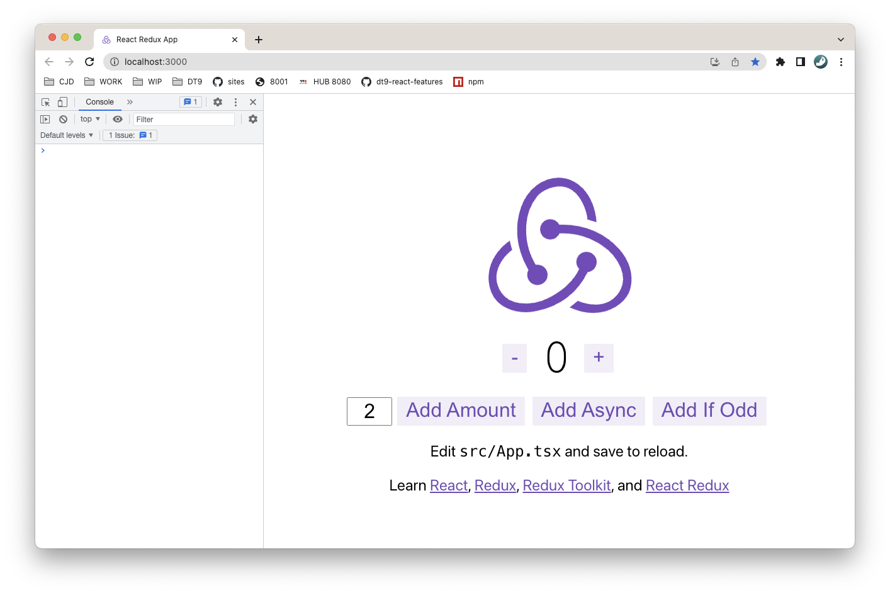

## Install Features to CRA

Features can in theory be installed to any React App. To make sure this is the case, we're going to use create-reat-app to create a typical React app with redux and @redux-toolkit. We will then install Features and verify it works

#### Create React App

The recommended way to start new apps with React and Redux is by using the official Redux+JS template or [Redux+TS template](https://redux-toolkit.js.org/introduction/getting-started) for Create React App, which takes advantage of Redux Toolkit and React Redux's integration with React components

```bash
cd <working-dir>
# Redux + TypeScript template
npx create-react-app my-app --template redux-typescript
cd myapp
npm start
```

myapp will open in default browser on the url http://localhost:3000 and look like this


